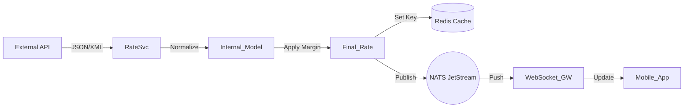

# 📡 Real-time Market Data Integration Guide

This document details the architectural implementation, configuration, and developer workflows for integrating real-time currency exchange rates into the **CashEx** platform.

## 1. System Overview

The Market Data Service (`RateSvc`) is responsible for:
1.  **Fetching** live rates from external providers (e.g., Wise, OpenExchangeRates, Fixer).
2.  **Normalizing** distinct provider formats into a unified internal model.
3.  **Applying Spreads** (Service Charges) dynamically based on admin rules.
4.  **Broadcasting** updates to the rest of the system via NATS JetStream.

### Data Flow Diagram



## 2. Integration Workflow

### Step 1: Rate Polling
The system uses a **Ticker** to poll configured providers at a set interval (default: 30s).
- **Failover Logic**: If the primary provider fails (timeout/5xx), the system automatically retries with the secondary provider.

### Step 2: Normalization
External APIs return data in various structures. The `RateSvc` maps these to:
```json
{
  "base": "USD",
  "rates": {
    "GBP": 0.785,
    "EUR": 0.912,
    "INR": 83.45
  },
  "timestamp": 1715623400
}
```

### Step 3: Distribution
*   **Redis**: Used for synchronous `GET /rate` requests (e.g., when a user opens the Exchange screen).
    *   Key: `rates:latest:{base_currency}`
    *   TTL: 60 seconds
*   **NATS**: Used for asynchronous updates to active WebSocket connections.
    *   Subject: `market.rates.update`

## 3. Developer Guide: Adding a New Provider

To add a new data provider (e.g., "AlphaVantage"), follow these steps:

### 3.1. Define the Provider Struct
Create a new file `pkg/rates/providers/alphavantage.go`:

```go
package providers

type AlphaVantageProvider struct {
    APIKey string
    Client *http.Client
}

func NewAlphaVantageProvider(apiKey string) *AlphaVantageProvider {
    return &AlphaVantageProvider{
        APIKey: apiKey,
        Client: &http.Client{Timeout: 5 * time.Second},
    }
}
```

### 3.2. Implement the Interface
Implement the `FetchRates` method required by the `RateProvider` interface:

```go
func (p *AlphaVantageProvider) FetchRates(base string) (map[string]float64, error) {
    // 1. Construct URL
    url := fmt.Sprintf("https://www.alphavantage.co/query?function=CURRENCY_EXCHANGE_RATE&from_currency=%s&...", base)
    
    // 2. Make Request
    resp, err := p.Client.Get(url)
    if err != nil {
        return nil, err
    }
    defer resp.Body.Close()
    
    // 3. Parse Response & Return
    // ... logic to parse JSON ...
    return rates, nil
}
```

### 3.3. Register in Factory
Update `pkg/rates/factory.go` to include the new provider string:

```go
func GetProvider(name string, config Config) (RateProvider, error) {
    switch name {
    case "wise":
        return NewWiseProvider(config.WiseAPIKey), nil
    case "alphavantage": // Add this case
        return NewAlphaVantageProvider(config.AlphaKey), nil
    default:
        return nil, fmt.Errorf("unknown provider: %s", name)
    }
}
```

## 4. Configuration

The service is configured via `config.yaml` or Environment Variables.

| Variable | Description | Default |
| :--- | :--- | :--- |
| `RATES_PROVIDER` | Primary data source name | `openexchangerates` |
| `RATES_API_KEY` | Secret key for the API | `""` |
| `RATES_REFRESH_SEC` | Function interval time | `30` |
| `RATES_BASE_MARGIN` | Default % margin added | `2.5` |

Example `config.yaml`:
```yaml
rates:
  provider: "fixer"
  api_key: "abc123xym..."
  refresh_interval: 30s
  margins:
    USD: 2.0
    GBP: 1.5
```
