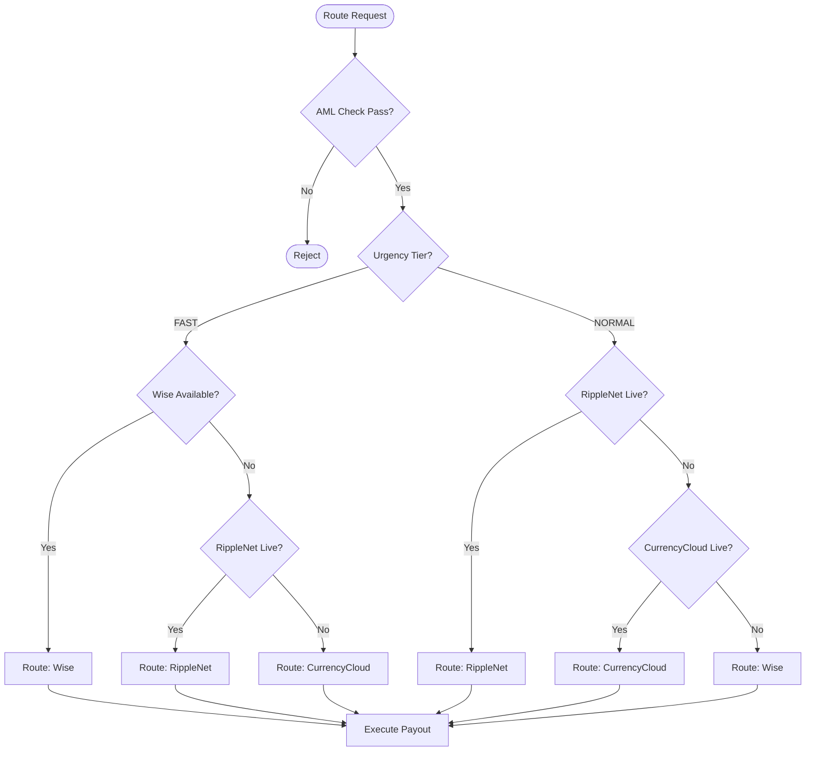

<!-- Author: Ratheesh G Kumar, Software Engineer, Team CurrencyXnge_fintech SaaS Product -->
# 🛣️ Global Routing Engine (Wise + CurrencyCloud + Ripple)

This document details the architecture of the **Smart Routing Engine**, designed to optimize international payments by dynamically selecting the best provider based on speed, cost, and corridor availability.

## 1. Routing Strategy Overview

The Routing Engine operates within the `RemittanceSvc`. It evaluates every transaction against a set of business rules to decide the optimal **Payment Rail**.

### Supported Providers
1.  **Wise (TransferWise)**: Best for speed and mid-market rates (Consumer corridors).
2.  **CurrencyCloud**: Best for B2B, reliable FX, and compliance coverage (180+ countries).
3.  **RippleNet (XRP Ledger)**: Best for instant liquidity in exotic/high-friction corridors (e.g., UK -> Philippines/Mexico).

   *Note: RippleNet integration assumes usage of ODL (On-Demand Liquidity) where regulation permits.*

---

## 2. Decision Logic Tree

The engine uses a tiered waterfall model.



---

## 3. Go Interface Design

We use a **Strategy Pattern** to make providers pluggable.

### 3.1. The Provider Interface
Defined in `internal/domain/routing/provider.go`.

```go
type RemitProvider interface {
    // Get a finalized quote (rate + fees)
    GetQuote(ctx context.Context, req QuoteRequest) (*QuoteResponse, error)
    
    // Execute the actual money movement
    ExecutePayout(ctx context.Context, req PayoutRequest) (*PayoutResponse, error)
    
    // Check status of an inflight transfer
    CheckStatus(ctx context.Context, providerRef string) (Status, error)
    
    // Get live health/liquidity status
    HealthCheck(ctx context.Context) error
}
```

### 3.2. Sample Routing Logic
Defined in `internal/service/router.go`.

```go
func (r *Router) SelectProvider(req RouteRequest) (RemitProvider, error) {
    // 1. Rule: Exotic Corridors (e.g., PHP, MXN) -> Prefer Ripple for speed
    if IsExotic(req.Currency) && r.Ripple.IsAvailable() {
        return r.Ripple, nil
    }

    // 2. Rule: High Urgency -> Prefer Wise
    if req.Urgency == "FAST" {
        if r.Wise.IsAvailable() {
            return r.Wise, nil
        }
    }

    // 3. Rule: Default / B2B -> CurrencyCloud
    return r.CurrencyCloud, nil
}
```

---

## 4. Integration Details

### 4.1. Wise (REST API)
*   **Auth**: API Key (Profile ID)
*   **Flow**:
    1.  `POST /v2/quotes`: Create quote.
    2.  `POST /v1/transfers`: Create transfer.
    3.  `POST /v3/profiles/{id}/transfers/{id}/payments`: Fund transfer.

### 4.2. CurrencyCloud (REST API)
*   **Auth**: Auth Token (Login session)
*   **Flow**:
    1.  `GET /v2/rates/detailed`: Get rate.
    2.  `POST /v2/conversions/create`: Book FX.
    3.  `POST /v2/payments/create`: Send payment.

### 4.3. RippleNet (gRPC / RippleAPI)
*   **Auth**: mTLS / API Key
*   **Flow**:
    1.  **Quote**: Query ODL provider for rate.
    2.  **Prepare**: Lock liquidity on ledger.
    3.  **Submit**: Sign and submit XRP transaction.
    4.  **Verify**: Listen for ledger close/validation.

---

## 5. UK Funding & Settlement Flow (GBP)

As a UK-based MSB, funding the Payout Broker is the critical first step before they release funds to the beneficiary.

### 5.1. The "Pre-Funding" Model (Instant)
To achieve **Instant Remittance**, the MSB must hold a "float" balance in the Broker's multi-currency wallet.

**Flow**:
1.  **MSB Treasury** sends £50,000 via **UK Faster Payments** to their Wise Business Account (typically arrives in seconds).
2.  **App Routing Engine** detects available balance in Wise: `GBP: 50,000`.
3.  **Customer Txn**: Sends £500 to India.
4.  **Execution**: Wise debits the MSB's pre-funded GBP balance and pays out INR instantly.

### 5.2. The "Just-in-Time" Model (Normal/Saver)
Used for larger B2B transfers or cost optimization.

**Flow**:
1.  **Customer** transfers £10k to MSB (via Open Banking / Manual Transfer).
2.  **MSB** waits for funds to clear.
3.  **MSB** instructs Broker (CurrencyCloud) to "Book Deal".
4.  **Settlement**: MSB wires funds to CurrencyCloud.
5.  **Payout**: CurrencyCloud releases funds T+1.

---

## 6. Fee & Charges Configuration

We must model both the **Cost** (what Broker charges us) and the **Price** (what we charge user).

### 6.1. Broker Cost Structure
| Broker | Fee Type | Typical Cost (GBP -> INR) | Billing Method |
| :--- | :--- | :--- | :--- |
| **Wise** | Fixed + % | £0.20 + 0.45% | Deducted from Source Amount |
| **CurrencyCloud** | Spread + Fixed | ~0.3% Spread + £3.00 (SWIFT) | Monthly Invoice or Spread |
| **RippleNet** | Network Fee | ~0.0001 XRP (Negligible) | Burned on Ledger |

### 6.2. Pricing Strategy Implementation
The `RateSvc` calculates the final charge displayed to the user.

```go
// internal/service/pricing.go

func CalculateTotal(req Request, brokerCost float64) Total {
    // 1. Base Cost from Broker (e.g. £4.50)
    
    // 2. Add our Margin (Profit)
    myMargin := req.Amount * 0.01 // 1%
    
    // 3. Add Fixed Service Charge
    serviceFee := 2.99 // GBP
    
    // 4. Net Price to User
    return Total{
        Payable: req.Amount + serviceFee,
        ExchangeRate: MarketRate - Spread, 
    }
}
```

---

## 7. Failover & Reliability (NATS)

All routing execution is wrapped in **Message Queues**.

1.  **Request**: App publishes `cmd.payout.execute` to NATS.
2.  **Worker**:
    *   Subscribes to topic.
    *   Calls `Router.SelectProvider()`.
    *   Calls `Provider.ExecutePayout()`.
3.  **Failure**:
    *   If Provider A fails (500 Error), Nack the message.
    *   Retry logic attempts Provider B (Fallback).
4.  **Success**:
    *   Publishes `event.payout.submitted`.

---

## 8. Admin Configuration & Dashboard

Admins manage the brokers via the System Config API.

### 8.1. API Endpoints
*   `POST /admin/routing/disable`: "Disable Wise for INR corridor" (e.g., if Wise is down).
*   `POST /admin/routing/priority`: "Set Ripple as Priority 1 for MXN".
*   `PUT /admin/fees/broker`: Update the cost basis for a provider.

### 8.2. Broker Balance Monitoring
The system polls broker balances every 60s.
*   **Alert**: If `Wise_GBP_Balance < £5,000` -> Send Email to Treasury Team ("Top Up Urgent").

