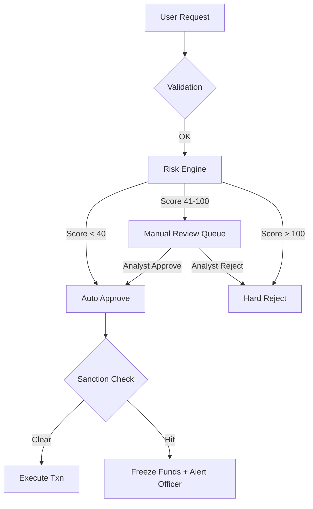

<!-- Author: Ratheesh G Kumar, Software Engineer, Team CurrencyXnge_fintech SaaS Product -->
# ⚖️ UK KYC/AML Compliance Framework (FCA Regulated)

This document outlines the **Mandatory Compliance Framework** for operating CurrencyEx as a Money Service Business (MSB) in the UK, adhering to **MLR 2017**, **PSD2**, and **FCA** regulations.

## 1. Regulatory Framework

The platform is engineered to comply with:
*   **Money Laundering Regulations 2017 (MLR 2017)**: Core AML/CTF rules.
*   **FCA Handbook (SYSC)**: Systems and controls for financial crime.
*   **JMLSG Guidance 2023**: Industry-standard interpretation of AML rules.
*   **Sanctions Screening**: HM Treasury (UK) & OFAC (US).
*   **GDPR**: Data privacy for customer documents.

---

## 2. KYC Requirements (Customer Due Diligence)

### 2.1. Individual Customers (B2C)

| Attribute | Collection Method | Validation Logic |
| :--- | :--- | :--- |
| **Legal Name** | Signup Form | Match ID Doc |
| **DOB** | Signup Form | Age ≥ 18 |
| **Address** | Form + lookup service | Must be GBR residential |
| **Mobile** | OTP Verification | 2FA capability |
| **ID Document** | Photo Upload | Passport / BRP / EU ID |
| **Liveness** | Selfie Video | 3D mapping vs ID Photo |
| **Source of Funds** | Declaration Form | Required if sending > £1,000 |

### 2.2. Corporate Customers (KYB)

*   **Certificate of Incorporation** (Companies House lookup).
*   **Shareholder Registry** (Identify UBOs > 25%).
*   **Director KYC**: Full KYC for at least 2 directors.

---

## 3. Sanctions & PEP Screening

Integration with providers like **ComplyAdvantage** or **Refinitiv World-Check** is mandatory.

**Screening Points**:
1.  **Onboarding**: Screen User + UBOs.
2.  **Transaction**: Screen Beneficiary Name + Bank.
3.  **Ongoing**: Daily delta screening of user base.

---

## 4. Risk Scoring Engine (`ComplianceSvc`)

Each user is assigned a dynamic **Risk Score (0-100)**.

### Scoring Matrix

| Factor | Condition | Points |
| :--- | :--- | :--- |
| **Static** | PEP Match | +100 (Critical) |
| | High-Risk Nationality (FATF Gray List) | +60 |
| | Cash-Intensive Profession | +30 |
| **Transactional**| Velocity > £2,500/day | +50 |
| | Structuring (Smurfing) Patterns | +70 |
| | New Beneficiary to High-Risk Corridor | +40 |

### Risk Thresholds
*   **0-40 (Low)**: Green Channel. Instant approval.
*   **41-100 (Medium)**: Amber Channel. Manual review required for large sums.
*   **101+ (High)**: Red Channel. Account Frozen. SAR Filing considered.

---

## 5. AML Pipeline Implementation

The `ComplianceSvc` acts as a gatekeeper in the standard transaction flow.

### Flow Diagram



### Database Updates (`audit_logs`)

Every decision is logged immutably.
```sql
INSERT INTO audit_logs (action, details) VALUES ('AML_CHECK', '{"score": 85, "reason": "High Velocity"}');
```

---

## 6. Purpose Codes & Limits

### UK Payment Purpose Codes
To be captured for all international payments.
*   `P01`: Family Maintenance / Savings
*   `P02`: Personal Gift
*   `P03`: Salary / Income
*   `P04`: Education Fees
*   `P06`: Goods & Services Trade

### Default Limits (Tier 1)
*   **Per Txn**: £2,500
*   **Daily**: £10,000
*   **Monthly**: £50,000

---

## 7. Suspicious Activity Reporting (SAR)

If `risk_score > 100` OR manual analyst flags activity:
1.  System generates internal SAR case.
2.  MLRO (Money Laundering Reporting Officer) reviews.
3.  If deemed suspicious, report filed with UK **NCA (National Crime Agency)** via SAR Online.
