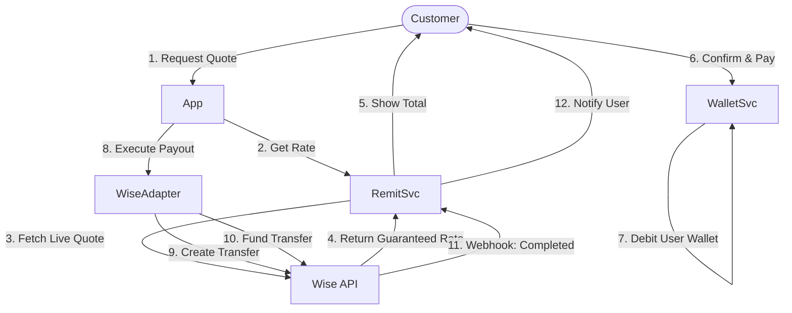

<!-- Author: Ratheesh G Kumar, Software Engineer, Team CurrencyXnge_fintech SaaS Product -->
# 🌍 Wise Remittance Integration & MSB Guide

This document details the single-provider integration strategy using **Wise (formerly TransferWise)** for all international remittance corridors, and explains the regulatory role of a Money Service Business (MSB).

## 1. What is an MSB? (UK Context)

A **Money Service Business (MSB)** is a legal definition for firms that provide money transmission, currency exchange, or cheque cashing services.

### 1.1. Regulatory Status
*   **HMRC Supervision**: For Anti-Money Laundering (AML) purposes. All MSBs must register.
*   **FCA Regulation**: If annual turnover > £3m, the MSB must be an **Authorized Payment Institution (API)**. If less, it is a **Small Payment Institution (SPI)**.
*   **Safeguarding**: Authorized MSBs must keep customer funds in separate, ring-fenced accounts (known as "Safeguarding Accounts") so they are protected if the MSB goes bust.

### 1.2. The MSB vs. The Broker (Wise) relationship
In this architecture:
*   **You (The Client/SaaS User)** are the **MSB**. You own the customer relationship, perform KYC, and take the money.
*   **Wise** is the **Payment Rail / Liquidity Provider**. You are a "Platform" or "Business" customer of Wise. You instruct Wise to move funds from *your* Wise balance to the beneficiary.

---

## 2. Wise Integration Architecture

Since Wise is our **sole** provider, the routing logic is simplified but the integration is deeper.



---

## 3. Integration Details (Wise Platform API)

### 3.1. Authentication
We use **API Tokens** generated from the Wise Business Profile.
*   **Base URL (Sandbox)**: `https://api.sandbox.transferwise.tech/v1`
*   **Base URL (Live)**: `https://api.transferwise.com/v1`

### 3.2. Core Workflows

#### A. Getting a Quote (`POST /v2/quotes`)
Locks the exchange rate for a temporary window (usually 30 mins).
```json
// Request
{
  "sourceCurrency": "GBP",
  "targetCurrency": "INR",
  "sourceAmount": 1000,
  "profile": "{{profileId}}"
}
```

#### B. Recipient Account (`POST /v1/accounts`)
Before sending money, we create a recipient object in Wise.
```json
{
  "currency": "INR",
  "type": "indian_ifsc",
  "accountHolderName": "John Doe",
  "details": {
    "ifscCode": "HDFC0001234",
    "accountNumber": "1234567890"
  }
}
```

#### C. Create Transfer (`POST /v1/transfers`)
Links the Quote to the Recipient.
```json
{
  "targetAccount": "{{recipientId}}",
  "quoteUuid": "{{quoteId}}",
  "customerTransactionId": "TXN-8821-INTERNAL-REF"
}
```

#### D. Fund Transfer (`POST /v3/profiles/{id}/transfers/{id}/payments`)
**Critical Step**: This instructs Wise to take funds from your **Multi-Currency Account (MCA)** balance.
```json
{
  "type": "BALANCE" 
}
```

---

## 4. Funding Models (The "Float")

Since we use Wise for everything, managing your Wise Balance (Liquidity) is vital.

### 4.1. Pre-Funding (Instant Payout)
*   **How it works**: You keep a standing balance of £50k (or more) in your Wise GBP Account.
*   **Customer Experience**: Remittance is instant. As soon as they pay you, you trigger the payout from your specific Wise balance.
*   **Reconciliation**: Every night, you top up your Wise balance via Bank Transfer from your main business bank account.

### 4.2. Low-Balance Monitoring
The system monitors your Wise Balance via `GET /v4/profiles/{id}/balances`.

| Condition | Alert Level | Action |
| :--- | :--- | :--- |
| Balance > £10,000 | 🟢 OK | None |
| Balance < £5,000 | 🟡 Warning | Email Treasury Team |
| Balance < £1,000 | 🔴 Critical | **Disable Instant Payouts** (Switch to T+1) |

---

## 5. Fee Structure & Profit

### 5.1. Wise Fees (Cost)
Wise charges a transparent fee (e.g., £0.29 + 0.49%). This is deducted from the source amount or charged separately depending on config.

### 5.2. Your Markup (Profit)
You earn money by adding a **Service Fee** and/or a **Rate Markup**.

*   **Wise Rate**: 1 GBP = 105.50 INR
*   **Your Config**: Spread = 1.00 INR
*   **Customer Rate**: 1 GBP = 104.50 INR
*   **Profit**: (1.00 INR * Amount) per transaction.

---

## 6. Regulatory Reporting (SARs)

Even though Wise performs sanctions screening on their end, **YOU (The MSB)** are liable for your customers.
*   If the **ComplianceSvc** flags a user (High Risk), you must **NOT** send the transaction to Wise.
*   Block it internally and file a SAR (Suspicious Activity Report) with the NCA if necessary.
