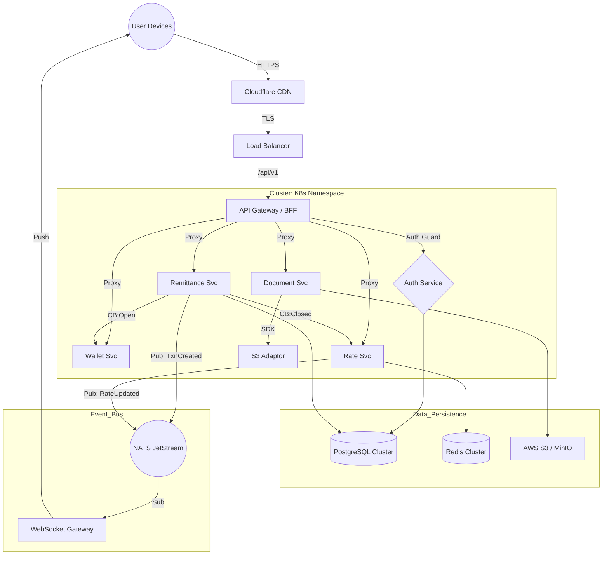

<!-- Author: Ratheesh G Kumar, Software Engineer, Team CurrencyXnge_fintech SaaS Product -->
# 🏗️ CurrencyEx Backend Master Architecture

This document serves as the **Single Source of Truth** for the backend engineering of the CurrencyEx platform. It covers architecture, infrastructure, code standards, and deployment strategies.

## 1. 📐 High-Level Architecture

The system follows a **Microservices Architecture** utilizing **Clean Architecture** principles within each service. Communication is handled via **gRPC/HTTP** for synchronous calls and **NATS JetStream** for asynchronous events.

### 📚 Detailed Technical Specifications
For deeper dives into specific areas, please refer to:
*   [**01_DATABASE_SCHEMA.md**](01_DATABASE_SCHEMA.md) - SQL Schema, Normalization & Redis Strategy.
*   [**02_API_MICROSERVICES.md**](02_API_MICROSERVICES.md) - Service Boundaries, API Versioning & Endpoints.
*   [**03_INFRA_CICD.md**](03_INFRA_CICD.md) - Docker, K8s Manifests & CI/CD Pipelines.
*   [**04_TESTING_STRATEGY.md**](04_TESTING_STRATEGY.md) - Unit, Integration & E2E Testing Standards.
*   [**05_AUTH_SECURITY.md**](05_AUTH_SECURITY.md) - JWT Auth Flow, Admin-Managed Staff & Casbin RBAC Rules.

### System Diagram



---

## 2. 📂 Repository Structure (Clean Architecture)

We strictly adhere to the Standard Go Project Layout.

```text
/
├── cmd/
│   ├── api/                # Main entry point for API Gateway
│   ├── remittance/         # Entry point for Remittance Service
│   └── worker/             # Background job workers
├── internal/
│   ├── domain/             # Entities & Repository Interfaces (Pure)
│   │   ├── transaction.go
│   │   └── user.go
│   ├── service/            # Business Logic / Use Cases
│   │   ├── transfer_service.go
│   │   └── rate_calculator.go
│   ├── adapter/            # Implementations (SQL, HTTP, S3)
│   │   ├── repository/     # Postgres/Redis impl
│   │   └── storage/        # S3 impl
│   └── handler/            # HTTP/gRPC Handlers
├── pkg/
│   ├── errors/             # Custom Error Package
│   ├── logger/             # Structured Logger (Zap/Zerolog)
│   ├── middleware/         # Auth, RateLimit, CORS
│   └── events/             # NATS Publisher/Subscriber Wrappers
├── config/                 # YAML/Env Config definitions
├── deployments/            # K8s Manifests, Helm Charts
├── docs/                   # Swagger/OpenAPI Specs
├── go.mod
└── Makefile
```

---

## 3. 🗄️ Database Schema (PostgreSQL)

### Users & Auth
```sql
CREATE TABLE users (
    id UUID PRIMARY KEY DEFAULT gen_random_uuid(),
    email VARCHAR(255) UNIQUE NOT NULL,
    password_hash VARCHAR NOT NULL,
    role VARCHAR(50) DEFAULT 'CUSTOMER', -- ADMIN, TELLER
    kyc_status VARCHAR(50) DEFAULT 'PENDING',
    created_at TIMESTAMPTZ DEFAULT NOW(),
    version INT DEFAULT 1
);
```

### Wallet & Ledger
```sql
CREATE TABLE wallets (
    id UUID PRIMARY KEY,
    user_id UUID REFERENCES users(id),
    currency VARCHAR(3) NOT NULL,
    balance DECIMAL(20, 8) DEFAULT 0,
    locked_balance DECIMAL(20, 8) DEFAULT 0,
    UNIQUE(user_id, currency)
);
```

### Transactions (Remittance/Exchange)
```sql
CREATE TABLE transactions (
    id UUID PRIMARY KEY,
    reference_id VARCHAR(20) UNIQUE, -- Public Ref (TXN-8821)
    sender_id UUID REFERENCES users(id),
    amount_sent DECIMAL(18, 2) NOT NULL,
    currency_sent VARCHAR(3) NOT NULL,
    amount_received DECIMAL(18, 2) NOT NULL,
    currency_received VARCHAR(3) NOT NULL,
    ex_rate DECIMAL(12, 6) NOT NULL,
    fees DECIMAL(10, 2) DEFAULT 0,
    status VARCHAR(50) NOT NULL, -- CREATED, PROCESSING, COMPLETED, FAILED
    metadata JSONB, -- Stores beneficiary snapshots
    created_at TIMESTAMPTZ DEFAULT NOW()
);
```

---

## 4. 🌐 API Endpoints & Versioning

All APIs are versioned via URL path.

**Base URL**: `https://api.currencyex.com/v1`

| method | endpoint | description | auth | rate_limit |
| :--- | :--- | :--- | :--- | :--- |
| `POST` | `/auth/login` | Login & get JWT | ❌ | 5/min |
| `GET` | `/rates/live` | Get live rates | ✅ | 60/min |
| `POST` | `/remit/quote` | Get exact quote (locks rate) | ✅ | 20/min |
| `POST` | `/remit/send` | Execute transfer | ✅ | 10/min |
| `GET` | `/wallet/balance` | View balances | ✅ | 100/min |
| `POST` | `/docs/upload` | Upload KYC Docs (S3) | ✅ | 10/min |

---

## 5. 🛡️ Resilience & Reliability

### Rate Limiting Strategy
Implemented using the **Token Bucket Algorithm** backed by Redis.
*   **Global Limit**: 1000 req/sec (DDoS protection at Gateway)
*   **User Limit**: Tiered (Basic: 60/min, Pro: 300/min).
*   **Header Response**:
    *   `X-RateLimit-Limit: 60`
    *   `X-RateLimit-Remaining: 59`
    *   `Retry-After: 30`

### Circuit Breaker Implementation
We use `sony/gobreaker` for inter-service calls (e.g., Remittance -> Core Banking).

```go
// pkg/resilience/breaker.go
var cb *gobreaker.CircuitBreaker

func InitBreaker() {
    settings := gobreaker.Settings{
        Name:        "CoreBanking",
        MaxRequests: 5,                // Half-open allowed requests
        Interval:    60 * time.Second, // Clear counts interval
        Timeout:     30 * time.Second, // Open state duration
        ReadyToTrip: func(counts gobreaker.Counts) bool {
            failureRatio := float64(counts.TotalFailures) / float64(counts.Requests)
            return counts.Requests >= 10 && failureRatio >= 0.6 // Trip if > 60% fail
        },
    }
    cb = gobreaker.NewCircuitBreaker(settings)
}

func CallExternalService() error {
    _, err := cb.Execute(func() (interface{}, error) {
        return http.Get("https://external-bank.com/api")
    })
    return err
}
```

---

## 6. ⚡ Events & WebSockets (NATS)

We use **NATS JetStream** for durable event processing.

### Subjects
*   `full.user.registered`: Triggers Welcome Email, Wallet Creation.
*   `full.txn.status_changed`: Triggers Audit Log, WebSocket Push.
*   `full.kyc.uploaded`: Triggers Compliance Check.

### WebSocket Event Payload
The Frontend subscribes to `user:{user_id}` via the WS Gateway.

```json
{
  "event": "transaction_update",
  "data": {
    "txn_id": "TXN-8821",
    "status": "COMPLETED",
    "timestamp": "2024-10-24T10:30:00Z"
  }
}
```

---

## 7. ☁️ Document Storage (S3 Integration)

The `DocSvc` abstracts file storage, supporting AWS S3 or MinIO.

### Interface
```go
type ObjectStorage interface {
    Upload(ctx context.Context, file io.Reader, path string) (string, error)
    GetSignedURL(ctx context.Context, path string, expiry time.Duration) (string, error)
}
```

### Bucket Structure
```text
s3://curencyex-secure-docs/
├── kyc/
│   ├── {user_id}/
│   │   ├── passport_front.jpg
│   │   └── utility_bill.pdf
├── receipts/
│   ├── {date}/
│   │   └── {txn_id}.pdf
```

---

## 8. ❌ Custom Error Handling

We map internal errors to standardized HTTP responses.

```go
// pkg/errors/errors.go
type AppError struct {
    Code    int    `json:"code"`    // Internal Error Code
    Message string `json:"message"` // User facing message
    Status  int    `json:"-"`       // HTTP Status Code
}

var (
    ErrInsufficientFunds = &AppError{Code: 1001, Message: "Insufficient wallet balance", Status: 400}
    ErrRateExpired       = &AppError{Code: 1002, Message: "Quote expired, please refresh", Status: 409}
)
```

---

## 9. 🚀 CI/CD & Deployment

### Docker Multi-Stage Build
```dockerfile
# Stage 1: Build
FROM golang:1.21-alpine AS builder
WORKDIR /app
COPY go.mod go.sum ./
RUN go mod download
COPY . .
RUN CGO_ENABLED=0 GOOS=linux go build -o main ./cmd/api

# Stage 2: Run (Distroless for security)
FROM gcr.io/distroless/static-debian11
COPY --from=builder /app/main .
CMD ["./main"]
```

### Kubernetes Cluster Logic
We use **Helm** for managing deployments.

`values.yaml` snippet:
```yaml
replicaCount: 3
autoscaling:
  enabled: true
  minReplicas: 3
  maxReplicas: 10
  targetCPUUtilizationPercentage: 80

resources:
  requests:
    cpu: 100m
    memory: 128Mi
  limits:
    cpu: 500m
    memory: 512Mi

livenessProbe:
  httpGet:
    path: /healthz
    port: 8080
```

### CI/CD Pipeline (GitLab CI / GitHub Actions)
1.  **Lint & Test**: `golangci-lint`, `go test ./...`
2.  **Build Docker**: Tag with commit SHA `registry.com/app:sha`.
3.  **Scan**: Trivy vulnerability scan.
4.  **Deploy Dev**: Helm upgrade to Dev Cluster.
5.  **Integration Test**: Run Postman/Newman collection.
6.  **Promote Prod**: Manual approval -> Helm upgrade Prod.
